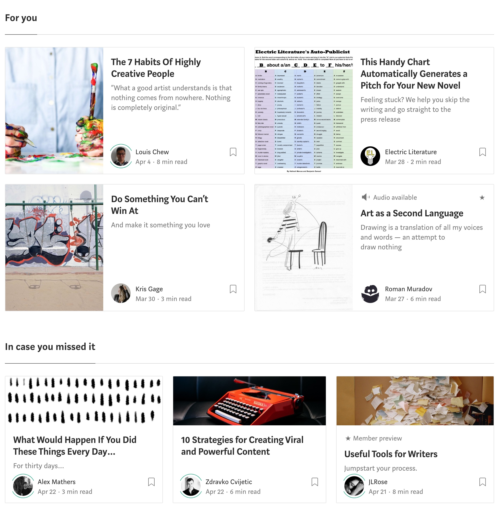

# Assignment 2

## Getting Started

1. Fork this repository and clone the code to your machine.
2. Setup your application
   ```bash
   # Make sure you run this command inside the week2 folder. Check via `pwd`
   # Not doing so may cause the create-react-app command to fail
   pwd
   # /path/to/week2
   create-react-app social-network
   ```
3. Ensure you can run your dev server
   ```bash
   cd social-network
   npm start

   # or if you're using yarn
   cd social-network
   yarn start
   ```

## Overview

For this assignment, you'll be creating a social network UI using React. We're going to focus on creating the UI elements for now, but the "Extras" section has additional tasks you can try out to add some interactive elements.

### Requirements

Recreate the provided screenshot from https://medium.com/topic/creativity.



Ensure that your UI meets the following criteria:

* Renders the provided data using React components.
    * Copy the JSON files in the `_data` folder into your project folder. Import them into a component like so (path may vary):
      ```js
      import missedArticles from './missed-articles.json';
      ```
* Uses React components that...
    * Are modular/reusable. For example, an author's bio could be considered a modular and reusable component on this page.
    * Use the appropriate loops/conditionals to map and display components.
    * Use propTypes to define props.
* Looks fairly close to the original screenshot.
    * Focus more on the React components first, then follow up with styling. More emphasis will be placed on the JavaScript code.

## Submission

1. In order for a valid submission, your app should run and display a UI when running `npm start`.
2. Create a pull request to this repository. There will be no CI.

## Bonus tasks

* Make each card clickable. Upon clicking a card, the browser should open the link for the article.
* Make each bookmark component clickable. Upon clicking a bookmark, the bookmark icon should turn green. Clicking the bookmark again will reset to the original state (no color).
